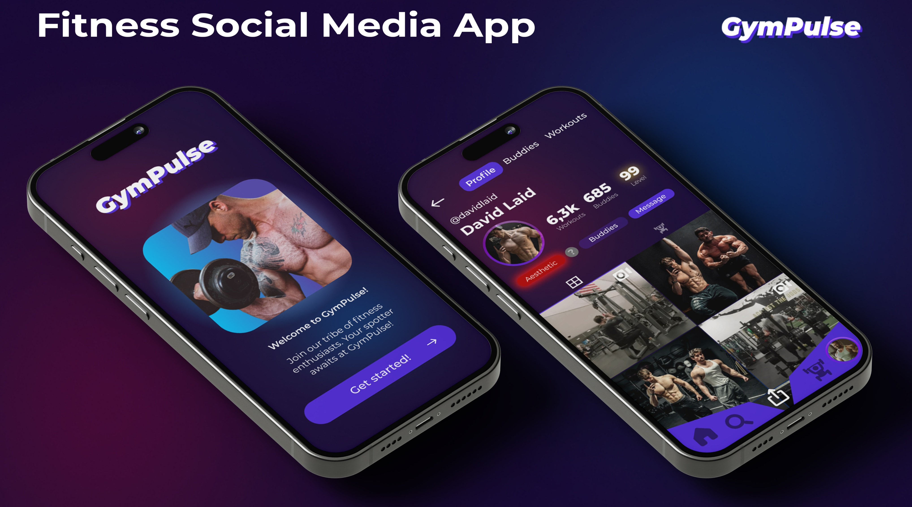

# GymPulse 🏋️‍♂️

## About the Project
GymPulse is a social networking platform tailored for fitness enthusiasts. It enables users to share their fitness journeys through photos, connect with others, and track their progress. Built with modern web technologies, GymPulse offers features like user registration, personalized profiles, post creation, and real-time interactions, all designed to foster a supportive fitness community.



## 🚀 Main Features

### 👤 Users
- Registration and login via email
- Personalized user profiles
- Following other users
- Updating profile and settings
- Notifications
- Account deletion

### 📱 Posts
- Creating posts with images
- Adding location and tags
- Liking and saving posts
- Grid and feed view of posts

### 🔍 Search
- Searching posts by content
- Filtering and sorting content
- Exploring popular posts
- Viewing trending tags

## 🛠️ Technical Stack

### Frontend
- **React** - UI library
- **TypeScript** - Typing
- **Vite** - Build tool
- **TailwindCSS** - Styling
- **React Query** - State management
- **React Router** - Routing

### Backend (Appwrite)
- Authentication
- Data storage
- File storage
- Real-time updates

## 📦 Installation

1. **Clone the repository**
```bash
git clone https://github.com/crnapagoda/GymPulse.git
cd gympulse
```

2. **Install dependencies**
```bash
npm install
```

3. **Configure environment**
Create a `.env` file based on the `.env.example` template:
```env
VITE_APPWRITE_PROJECT_ID=your_project_id
VITE_APPWRITE_URL=your_appwrite_url
VITE_APPWRITE_STORAGE_ID=your_storage_id
VITE_APPWRITE_DATABASE_ID=your_database_id
VITE_APPWRITE_SAVES_COLLECTION_ID=your_saves_collection_id
VITE_APPWRITE_POST_COLLECTION_ID=your_post_collection_id
VITE_APPWRITE_USER_COLLECTION_ID=your_user_collection_id
VITE_APPWRITE_FOLLOWING_COLLECTION_ID=your_following_collection_id
VITE_APPWRITE_NOTIFICATIONS_COLLECTION_ID=your_notifications_collection_id
```

4. **Run the application**
```bash
npm run dev
```

## 🌐 Deployment
The application is available at: [https://gym-pulse-ebon.vercel.app](https://gym-pulse-ebon.vercel.app)

## 📁 Project Structure

### Key Components
- `src/_auth/*` - Authentication components
- `src/components/*` - Shared components
- `src/_root/pages/*` - Application pages
- `src/lib/*` - Utility functions and configuration

### Styling
- `src/globals.css` - Global styles

### Configuration
- `src/lib/config.ts` - Appwrite configuration
- `src/lib/queries/*` - React Query hooks

## 🤝 Contributing to the Project

1. Fork the repository
2. Create a feature branch (`git checkout -b feature/AmazingFeature`)
3. Commit your changes (`git commit -m 'Add some AmazingFeature'`)
4. Push to the branch (`git push origin feature/AmazingFeature`)
5. Open a Pull Request

## 📝 License
MIT License - see the `LICENSE` file for details

## 🔗 Useful Links
- [Documentation](https://github.com/crnapagoda/GymPulse/wiki)
- [Report Bugs](https://github.com/crnapagoda/GymPulse/issues)
- [Appwrite Documentation](https://appwrite.io/docs)

## 📊 Project Status


